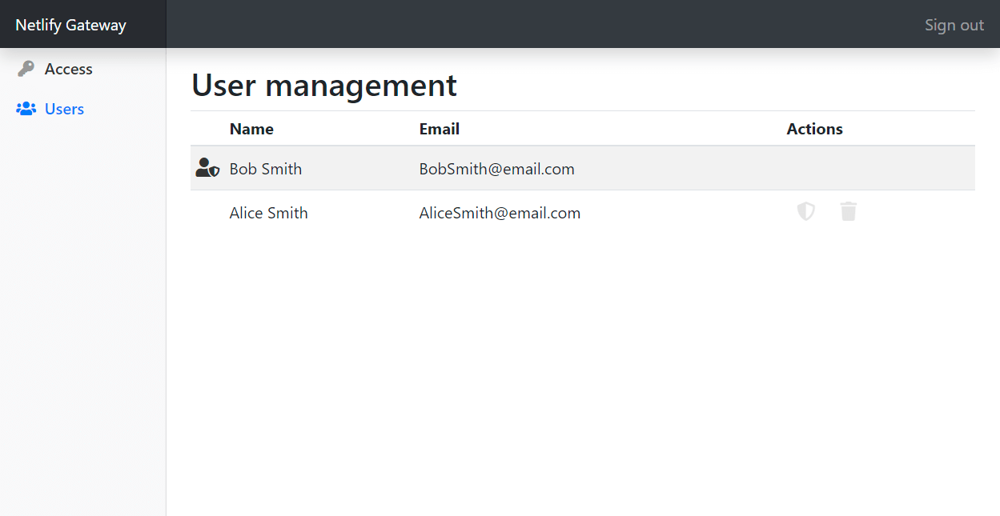
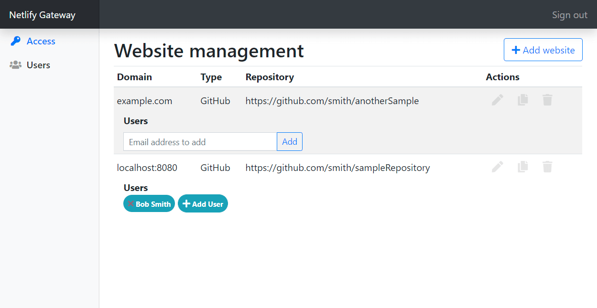

# Netlify-gateway-server

*This project is still a bit work in progress, not recommended for use in production. At the moment, only the gateway to GitHub is implemented - GitLab and Bitbucket will follow.*

This project provides an alternative to [Netlify's `git-gateway`](https://github.com/netlify/git-gateway): It provides a gateway to GitHub with the credentials being stored within the gateway. Authentication is being done using an external OAuth server, authorization can be managed within the gateway.

The main difference is that this project provides an integrated user management interface (which is restricted to administrators) for assigning different access rights to different users for different websites.


*Screenshot of the user management page*

Users will be automatically added to the user list once they login. They can then be promoted as administrators at the user management page.


*Screenshot of the website management page*

On the website management page new Netlify websites can be added, together with the baking repository the gateway should refer to and the necessary access token. If you would like to register a second website using the same access token, you can clone existing sites. Write access to the site's repository via the gateway can be granted via the "Add User" button - this function is limited to users, which have already logged in the gateway once.

---

## Setup

The project consists of two different parts, the server application and a client extension.

### Server

The gateway server can be simply run via node and customized by command line arguments:

| Argument                                      | Description                                                                                                          |
| --------------------------------------------- | -------------------------------------------------------------------------------------------------------------------- |
| `--port 3000`                                 | Port which the gateway server should listen on                                                                       |
| `--hostingUrl http://localhost`               | Public url of the gateway server                                                                                     |
| `--authServer https://demo.identityserver.io` | Url of the external OAuth server                                                                                     |
| `--authClientId interactive.public`           | `client_id` for accessing the OAuth server                                                                           |
| `--authClientSecret sEcREt123`                | `client_secret` for accessing the OAuth server                                                                       |
| `--authPkce`                                  | With this flag being set, PKCE will be used for accessing the OAuth server.                                          |
| `--adminSub 11`                               | For testing purposes and initial setup, admin rights can be granted to the external OAuth user with the given `sub`. |

### Client

First, setup the Netlify admin interface following [Netlify's guide](https://www.netlifycms.org/docs/add-to-your-site/).

Make sure, that your `config.yml` file contains the following:

```yaml
backend:
    name: git-gateway
    branch: master
    gateway_url: http://domain-of-the-gateway-server.com
    site_domain: http://domain-of-the-client.com
```

In addition, you have to include this project's client code to your admin's `index.html` file. Make sure, that you include it before the `netlify-cms` import:

```html
<!-- Include the script, which injects changes necessary for accessing our gateway server -->
<!-- TODO: edit this URL -->
<script src="https://unpkg.com/CHANGEME-this-project"></script>

<!-- Include the script that builds the page and powers Netlify CMS -->
<script src="https://unpkg.com/netlify-cms@^2.0.0/dist/netlify-cms.js"></script>
```
